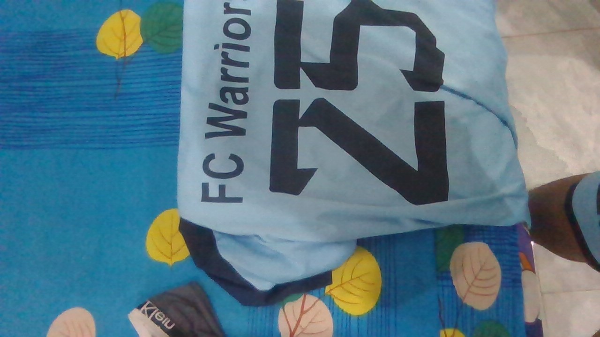

Moi them file readme.md

# đây là tương đương cấp 1

## đây là tương đương cấp 2

### đây là tương đương cấp 3

**Chữ in đậm**
_Chữ in nghiêng_

[google](https://www.google.com/)

- Mục 1
- Mục 2
  - Mục con 2.1
  - Mục con 2.2

| Thứ | Ngày     |
| --- | -------- |
| bảy | 19/08/23 |

# Mô Tả Đồ Án LEHUSO (Lê Hùng Sơn) - Quy Trình Mua Sắm Trực Tuyến

## Mô Tả

Đồ án này mô tả quy trình khách hàng thực hiện việc xem sản phẩm, thêm vào giỏ hàng, và thực hiện thanh toán trên trang web Thương mại điện tử LEHUSO (Lê Hùng Sơn).

### Các Chức Năng Đã Làm

#### Phân Hệ Khách Hàng

**Khách Hàng:**

- Đăng Nhập, Đăng Ký, Đăng Xuất
- Thêm Sản Phẩm Vào Giỏ Hàng
- Tìm Kiếm Sản Phẩm
- Xem Chi Tiết Sản Phẩm
- Thanh Toán
- Tạo Một Hoá Đơn
- Xem Đơn Hàng Cá Nhân
- Đánh Giá Sản Phẩm Bằng Sao
- Bình Luận Về Sản Phẩm
- Phân Trang (20 Sản Phẩm Mỗi Trang)
- Lọc Sản Phẩm: Theo Giá, Hãng, Loại Sản Phẩm

#### Phân Hệ Quản Trị (ADMIN)

**ADMIN:**

- Thống Kê So Sánh Giữa 2 Tháng Gần Nhất: Khách Hàng, Thu Nhập, Hoá Đơn
- Thống Kê Về Người Dùng, Hoá Đơn, Sản Phẩm Tại Mọi Thời Điểm
- Thay Đổi Trạng Thái Của Đơn Hàng
- CRUD Khách Hàng (Tạo, Đọc, Cập Nhật, Xóa)
- CRUD Sản Phẩm (Tạo, Đọc, Cập Nhật, Xóa)

### Công Nghệ Sử Dụng

- Front End: **ReactJS**, **Tailwind CSS**
- Hệ Thống Lưu Trữ Ảnh: **Cloudinary**
- Thanh Toán Hoá Đơn: **Stripe** (Tự Động Tạo Hoá Đơn Cho Khách Hàng)
- Back End: **NodeJS**
- Hệ Thống Lưu Trữ Dữ Liệu: **Mongodb Cloud** (No SQL)

Day la the p

- day la li
  [day la google](https://google.com)
  
  **Đây là in đậm nè**
  _Đây là in nghiêng nè_
  **_đây là 3 dấu _**

  > Cái này hình như chỉ để cho đẹp thôi

  Đây là đoạn code ` void swap(&a,&b)`
  `{}`

```js
Đây là dùng cho đoạn code dài nè
let a =1000;
123
1234
12345
123456
1234567
12345678
```

```cpp

int swap(&a,&b)
{

}
```

```html
<h2>Đây là thẻ h2</h2>
```

| Đây là cột 1 | đây là cột 2 |
| ------------ | ------------ |
| SƠM          | LÊ HÙNG      |

##toi moi viet cho no
##sieu conflict ne

## moi them vo boi branch HanldeB
